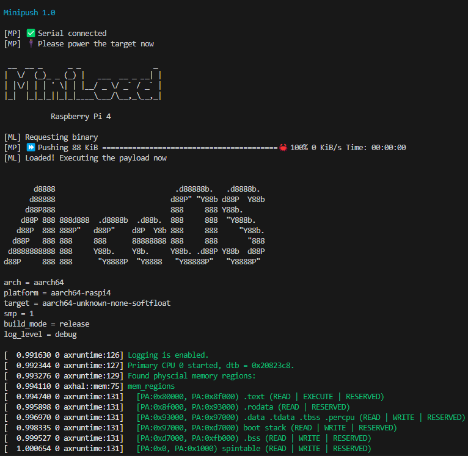

### 编译生成并烧录

Raspberry Pi Imager 烧录一个64位系统SD卡，删除所有内容。
从Raspberry Pi firmware repo中将以下文件复制到SD卡上：

[fixup4.dat](https://github.com/raspberrypi/firmware/raw/master/boot/fixup4.dat) <br>
[start4.elf](https://github.com/raspberrypi/firmware/raw/master/boot/start4.elf) <br>
[bcm2711-rpi-4-b.dtb](https://github.com/raspberrypi/firmware/raw/master/boot/bcm2711-rpi-4-b.dtb) <br>

[config.txt](./config.txt)

从 tools 文件夹复制 chainboot 固件到SD卡上：
[kernel8.img](../../../tools/raspi4/common/image/chainboot/kernel8.img)


项目根目录下执行：
```shell
make PLATFORM=aarch64-raspi4 A=apps/boards/raspi4-usb LOG=debug chainboot
```
开发板接好 usb转串口，插入usb，并上电。

