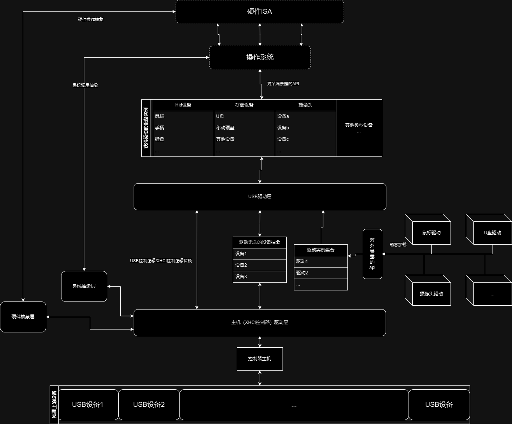

[TOC]

| App                         | Extra modules | Enabled features | Description             |
| --------------------------- | ------------- | ---------------- | ----------------------- |
| [usb-hid](../apps/usb-hid/) |               |                  | A usb-hid mouse example |

# 介绍-中文

## 运行方法

### 环境需求

* 一张飞腾派开发板

* 一张sd卡，上面应当刷好了飞腾官方所提供的[uboot镜像/系统镜像](https://gitee.com/phytium_embedded/phytium-pi-os)

* linux环境

* python，需要安装pyserial,xmodem,serial模块
  
  * pip install pyserial serial xmodem

* minicom
  
  * sudo apt install minicom #如果你用的是ubuntu

### 运行步骤

1. 确认你的USB串口线正确的连接到了飞腾派的UART1 DEBUG输出

2. 确保串口被正确识别为/dev/ttyUSB0

3. 清除uboot上的启动环境变量(bootenv)，方法为在uboot终端内输入
   
   ```shell
   setenv bootcmd '';saveenv;
   ```

4. 确保鼠标已经插在板子上了(位置为靠近正面风扇的第一个usb3.0口(蓝色口))

5. 编译并运行,命令如下
   
   ```shell
   make A=apps/usb-hid PLATFORM=aarch64-phytium-pi LOG=trace chainboot
   ```

6. 给板子上电开机，等待编译结果传输完成（脚本会自动将编译结果加载到0x90100000)

7. 此时会自动进入minicom界面，输入go 0x90100000

8. 试试移动/点击鼠标，看看终端上的响应输出

## usb 系统架构:



# INTRODUCTION-English

## RUN

### Prequireties

* Phytium Pi board

* a sd card with Uboot from [Phytium's Fork](https://gitee.com/phytium_embedded/phytium-pi-os)

* linux 

* python with pyserial, xmodem,serial package
  
  * pip install pyserial serial xmodem

* minicom
  
  * sudo apt install minicom # if use ubuntu

### Build&Run step

1. ensure UsbSerial wire connect to Phytium Pi board with Uart 1 Debug port

2. ensure yor usb-serial was recognized so that you had /dev/ttyUSB0

3. clear uboot's bootenv with 
   
   ```shell
   setenv bootcmd '';saveenv;
   ```

4. ensure usb mouse has plugged in to proper position(first usb 3.0 port, close to front side of board)

5. run command at project root:
   
   ```shell
   make A=apps/usb-hid PLATFORM=aarch64-phytium-pi LOG=trace chainboot
   ```

6. poweron board, waiting for [compile result](../apps/usb-hid/usb-hid_aarch64-phytium-pi.bin) load into address 0x90100000 by our [script](../tools/phytium-pi/yet_another_uboot_transfer.py) via uboot xmodem file transfer

7. type "go 0x90100000"

8. then the application was started automaticlly, try to move your mouse,or click some button! and see signal comes out in terminal

## usb system structure:


